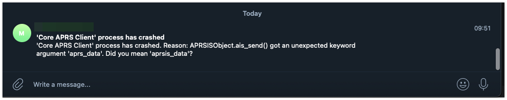

# Crash Handler Configuration

> [!NOTE]
> These are optional settings for the bot's crash handler. When activated, the bot will (try to) send you a crash notification prior to its program termination. For this task, the bot uses the [Apprise Notification Library](http://www.github.com/caronc/apprise) whose messenger configuration depends on an external configuration file. If both Apprise messenger configuration file AND the bot's crash file are present, then `core-aprs-client` will try to send you a zipped version of that file - which will make it easier for you to both detect program crashes and also determine its potential root cause (thanks to being able to access that log file).

| Config variable       | Type  | Default value | Description                                                                                                                                                                                                                                                                                                                                                                                                                       |
|-----------------------|-------|---------------|-----------------------------------------------------------------------------------------------------------------------------------------------------------------------------------------------------------------------------------------------------------------------------------------------------------------------------------------------------------------------------------------------------------------------------------|
| `apprise_config_file` | `str` | `apprise.yml` | Defines the [Apprise Notification Library](http://www.github.com/caronc/apprise)'s [configuration file](https://github.com/caronc/apprise/wiki/config_yaml). An [Apprise demo template](https://github.com/joergschultzelutter/core-aprs-client/blob/master/src/apprise.yml.TEMPLATE) file has been added to this repository. Set this configuration entry to the `NOT_CONFIGURED` value if you do not want to use this function. |
| `nohup_filename`      | `str` | `nohup.out`   | Configures the name of the file that we have to send to the user in case the client has crashed. For example, assume that we started the `core-aprs-cient` by initiating `nohup python core_aprs_client.py >nohup.out &`, then `nohup.out` would need to be specified as value.                                                                                                                                                   |

> [!TIP]
> If one (or both) of these settings point to an invalid file name, an empty value setting or use `NOT_CONFIGURED` as setting, then the crash handler gets deactivated.

> [!INFORMATION]
> `apprise_config_file` is a shared resource and is used by the class' [`send_apprise_message`](https://github.com/joergschultzelutter/core-aprs-client/blob/apprise-messaging-method/docs/coreaprsclient_class.md#send_apprise_message-class-method) function as a default for its Apprise config file. Note that the user _can_ overwrite these settings in the `send_apprise_message` function, thus making it possible to disable the crash handler and still enable Apprise messaging at the same time. 

The respective section from `core-aprs-client`'s config file lists as follows:

```
[coac_crash_handler]
#
# Apprise config file name
# Reference to an Apprise (https://github.com/caronc/apprise) configuration file
# If value is set to NOT_CONFIGURED, Apprise messaging will be ignored
apprise_config_file = apprise.yml
#
# file name of the "nohup" file
# When you start the client, you will run something like
#
# nohup python core_aprs_client.py >nohup.out &
#
# If the apprise config is enabled AND you have specified a correct file name
# for this setting, the client will try to message you a potential call stack file
# in case the program crashes
nohup_filename = nohup.out
```

All crash messages will be sent to Apprise - which will then forward the content to the messenger accounts configured in `apprise_config_file`. Dependent on whether the `nohup_filename` resource is available, that message might also contain this file as attachment. Example:

